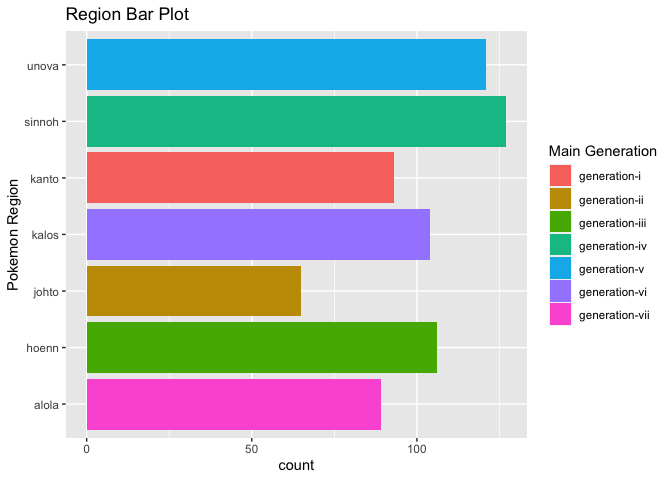

ST558-Project1-Vignette
================
Jovanni Catalan Hurtado
2022-06-23

-   [0.1 Intro](#01-intro)
-   [0.2 Required Packages](#02-required-packages)
-   [0.3 Functions for each API call](#03-functions-for-each-api-call)
-   [0.4 EDA](#04-eda)

## 0.1 Intro

-   As part of this Vignette I will be creating some functions to make
    use of APIs to obtain some data on Pokemon. They will retrieve
    information on pokemon based on the: **Pokemon Name, Pokemon Shape,
    Pokemon Type, Region, Move name and Move Type**.
-   I will be creating numerical and graphical summaries mainly on
    heights and weights of pokemon but also on count of locations by
    region
-   [PokeAPI](https://pokeapi.co/docs/v2#pokemon) is the source I used
    for the APIs and data

## 0.2 Required Packages

-   Base R
-   httr
-   rjson
-   tidyverse:
    -   ggplot2
    -   tibble
    -   dplyr
    -   tidyr

## 0.3 Functions for each API call

``` r
library(httr)
library(rjson)
library(tidyverse)
```

``` r
## Helper to make the actual API call and get results
makeAPICallHelper <- function(endpoint, value, str){
  # Make sure string is passed
  if(!is.character(value)){
    message <- paste("Please pass in a pokemon ", str, " as a string", sep = "")
    stop(message)
  }
  
  # Create appropriate API Url
  value <- tolower(value)
  apiEndPointURL <- paste("https://pokeapi.co/api/v2/", endpoint, "/", value, "/", sep = "")
  
  # Make API call and parse result
  result <- GET(apiEndPointURL)
  if(result$status_code == 200){
    parsed <- fromJSON((rawToChar(result$content)))
  } else{
    message("No results returned for", " ", value)
    return(NULL)
  }
  return(parsed)
}

## Functions to pass in appropriate endpoints/values to helper function.
### 1  
getPokemon <- function(pokemon){
  parsedResult <- makeAPICallHelper("pokemon", pokemon, "name")
  
  if(is.null(parsedResult)){
    return(NULL)
  }
  
  # Get vector of abilities
  abilities <- vector()
  for( ability in parsedResult$abilities){
    abilities <- append(abilities, ability$ability$name)
  }
  
  # Get vector of types
  types <- vector()
  for( type in parsedResult$types){
    types <- append(types, type$type$name)
  }
  
  # Create dfs/tibbles
  n <- length(abilities)
  tibAbilities <- tibble("Name" = rep(parsedResult$species$name, n),
                         "Height" = rep(parsedResult$height, n),
                         "Weight" = rep(parsedResult$weight, n), "Abilities" = abilities)
  
  n <- length(types)
  tibTypes <- tibble("Name" = rep(parsedResult$species$name, n), "Height" = rep(parsedResult$height, n),
                     "Weight" = rep(parsedResult$weight, n), "Types" = types)

  # Return list of 2 tibbles
  return(list(Abilities = tibAbilities, Types = tibTypes))
}

### 2
getPokemonFromHabitat <- function(habitat){
  parsedResult <- makeAPICallHelper("pokemon-habitat", habitat, "habitat")
  
  if(is.null(parsedResult)){
    return(NULL)
  }
  
  allSpecies <- vector()
  for( species in parsedResult$pokemon_species){
    allSpecies <- append(allSpecies, species$name)
  }
  n <- length(allSpecies)
  
  tib <- tibble("Habitat" = rep(parsedResult$name, n), "Species" = allSpecies)
  return(tib)
}


### 3
getRegion <- function(region){
  parsedResult <- makeAPICallHelper("region", region, "region")
  
  if(is.null(parsedResult)){
    return(NULL)
  }
  
  locations <- vector()
  for(location in parsedResult$locations){
    locations <- append(locations, location$name)
  }
  
  pokedexes <- vector()
  for(pokedex in parsedResult$pokedexes){
    pokedexes <- append(pokedexes, pokedex$name)
  }
  
  n <- length(locations)
  tibLocations <- tibble("Region" = rep(parsedResult$name, n), "Main Generation" = rep(parsedResult$main_generation$name, n), "Location" = locations)
  
  n <- length(pokedexes)
  tibPokedexes <- tibble("Region" =rep(parsedResult$name, n), "Main Generation" = rep(parsedResult$main_generation$name, n), "Pokedex" = pokedexes)

  #Returns 2 tibbles yay!
  return(list(Locations = tibLocations, Pokedexes = tibPokedexes))
  }

### 4
getMove <- function(move){
  parsedResult <- makeAPICallHelper("move", move, "move")
  
  if(is.null(parsedResult)){
    return(NULL)
  }
  
  learnedBy <- vector()
  for(pokemon in parsedResult$learned_by_pokemon){
    learnedBy <- append(learnedBy, pokemon$name)
  }
  
  n <- length(learnedBy)
  #Create and return df/tibble
  tib <- tibble("Move Name" = rep(parsedResult$name, n), "Move Type" = rep(parsedResult$type$name, n), 
                "Damage Classs" = rep(parsedResult$damage_class$name, n), "Accuracy" = rep(parsedResult$accuracy, n),
                "Power" = rep(parsedResult$power, n), "PP" = rep(parsedResult$pp, n), "Move Generation" = rep(parsedResult$generation$name, n),
                "Learned By" = learnedBy, )
  return(tib)
}

### 5
getPokemonFromShape <- function(shape){
  parsedResult <- makeAPICallHelper("pokemon-shape", shape, "shape")
  
  if(is.null(parsedResult)){
    return(NULL)
  }
  
  ## Get list of pokemon species with this shape
  speciesList <- vector()
  for(species in parsedResult$pokemon_species){
    speciesList <- append(speciesList, species$name)
  }
  n <- length(speciesList)
  
  #Create and return df/tibble
  tib <- tibble("Shape Type" = rep(parsedResult$name, n), "Species" = speciesList)
  return(tib)
}

### 6
getPokemonFromType <- function(type){
  parsedResult <- makeAPICallHelper("type", type, "type")
  
  if(is.null(parsedResult)){
    return(NULL)
  }
  
  pokemons <- vector()
  for(pokemon in parsedResult$pokemon){
    pokemons <- append(pokemons, pokemon$pokemon$name)
  }
  n <- length(pokemons)
  
  tib <- tibble("Type" = rep(parsedResult$name, n), "Type Damage Class" = rep(parsedResult$move_damage_class$name, n),
                "Type Generation" = rep(parsedResult$generation$name, n), "Pokemon" = pokemons)
  return(tib)
}

### 7
getMovesFromType <- function(type){
  parsedResult <- makeAPICallHelper("type", type, "type")
  
  if(is.null(parsedResult)){
    return(NULL)
  }
  
  moves <- vector()
  for(move in parsedResult$moves){
    moves <- append(moves, move$name)
  }
  n <- length(moves)
  
  tib <- tibble("Type" = rep(parsedResult$name, n), "Type Damage Class" = rep(parsedResult$move_damage_class$name, n),
                "Type Generation" = rep(parsedResult$generation$name, n), "Moves" = moves)
  return(tib)
}
```

## 0.4 EDA

### 0.4.1 Regions: One-Way Table & Bar Plot

``` r
kantoRegion <- getRegion("Kanto")
johtoRegion <- getRegion("Johto")
hoennRegion <- getRegion("Hoenn")
sinnohRegion <- getRegion("Sinnoh")
hisuiRegion <- getRegion("Hisui")
unovaRegion <- getRegion("Unova")
kalosRegion <- getRegion("Kalos")
alolaRegion <- getRegion("Alola")
galarRegion <- getRegion("Galar")

## Add all observations fro all regions together into one df
locationsByRegion <- rbind(kantoRegion$Locations,
johtoRegion$Locations,
hoennRegion$Locations,
sinnohRegion$Locations,
hisuiRegion$Locations,
unovaRegion$Locations,
kalosRegion$Locations,
alolaRegion$Locations,
galarRegion$Locations)


## Create One-way contingency table for the number of locations for each region
contTable <- table(locationsByRegion$Region)
contTable
```

    ## 
    ##  alola  hoenn  johto  kalos  kanto sinnoh  unova 
    ##     89    106     65    104     93    127    121

``` r
## Bar Plot
ggplot(locationsByRegion, aes(x=Region)) +
  geom_bar(aes(fill=`Main Generation`)) +
  labs(title = "Region Bar Plot", x = "Pokemon Region") +
  coord_flip()
```

<!-- -->

``` r
## It seems like the number of locations for each region can vary
## somewhat but are somewhere around 100, with a few exceptions
## mainly hisui and galar regions that have 0 locations. This just seems
## like this particular source is lacking in some information for those regions.
## Also, each region has only one main generation.
```

### 0.4.2 **Rare** Pokemon Weights: Histogram

``` r
#Get Information for rare Pokemon
rarePokemon <- getPokemonFromHabitat("rare")
  rarePokemonTypesInfo <- tibble()
  for(pokemon in rarePokemon$Species){
    result <- getPokemon(pokemon)
    if(!is.null(result)){
     rarePokemonTypesInfo <- rbind(rarePokemonTypesInfo, result$Types)
    }
  }
```

    ## No results returned for deoxys

``` r
##Let's first see the counts for each pokemon type category
table(rarePokemonTypesInfo$Types)
```

    ## 
    ##   dragon electric     fire   flying      ice  psychic 
    ##        1        1        2        6        1        4

``` r
## It seems like most of the rare pokemon in our data are of flying and psychic types
  
## Plot histogram for rare pokemon
ggplot(rarePokemonTypesInfo, aes(Weight/10)) +
  geom_histogram(fill="blue") +
  labs(title= "Weight Histogram(kg)",x = "Pokemon Weight")
```

    ## `stat_bin()` using `bins = 30`. Pick better value with `binwidth`.

/Project/Project%201/jovannicatalan.github.io/README_files/figure-gfm/unnamed-chunk-2-1.png)<!-- -->

``` r
## From this histogram we can see that there is wide range of weights
## for rare pokemon and that rarity and weight do not seem to be       related.
```

### 0.4.3 **Grassland** vs **Mountain** Pokemon Weights and Heights: Histograms

``` r
###Grassland
#Get Information for grassland Pokemon
grasslandPokemon <- getPokemonFromHabitat("grassland")
  grasslandPokemonTypesInfo <- tibble()
  for(pokemon in grasslandPokemon$Species){
    result <- getPokemon(pokemon)
    if(!is.null(result)){
     grasslandPokemonTypesInfo <- rbind(grasslandPokemonTypesInfo, result$Types)
    }
  }
  
## Remove duplicate pokemon and get Height and Weight in meters and kg
## Add Habitat column
grasslandPokemonTypesInfo <- grasslandPokemonTypesInfo %>%
  group_by(Name) %>%
  summarise(Height = median(Height)/10, Weight = median(Weight)/10, Habitat = "Grassland")

###Mountain
#Get Information for mountain Pokemon
mountainPokemon <- getPokemonFromHabitat("mountain")
  mountainPokemonTypesInfo <- tibble()
  for(pokemon in mountainPokemon$Species){
    result <- getPokemon(pokemon)
    if(!is.null(result)){
     mountainPokemonTypesInfo <- rbind(mountainPokemonTypesInfo, result$Types)
    }
  }
  
## Remove duplicate pokemon and get Height and Weight in meters and kg
## Add Habitat column
mountainPokemonTypesInfo <- mountainPokemonTypesInfo %>%
  group_by(Name) %>%
  summarise(Height = median(Height)/10, Weight = median(Weight)/10, Habitat = "Mountain")


### Combine Grassland and Mountain Observations(Pokemon Info)
grasslandMountainPokemon <- rbind(grasslandPokemonTypesInfo, mountainPokemonTypesInfo)

## Let's first do some numberical summaries for weight and height
summary(grasslandMountainPokemon$Weight)
```

    ##    Min. 1st Qu.  Median    Mean 3rd Qu.    Max. 
    ##    0.50    8.80   30.00   53.42   70.50  460.00

``` r
summary(grasslandMountainPokemon$Height)
```

    ##    Min. 1st Qu.  Median    Mean 3rd Qu.    Max. 
    ##   0.300   0.600   0.900   1.062   1.400   3.500

``` r
sd(grasslandMountainPokemon$Weight)
```

    ## [1] 72.09803

``` r
sd(grasslandMountainPokemon$Height)
```

    ## [1] 0.6002397

``` r
## Things to note:
## Heights have a median of .9 meters with std. dev = .6 meters
## Weights have a median of around 53 kg with std. dev = 72.1 kg


## Plot weight histograms for grassland v. mountain pokemon
ggplot(grasslandMountainPokemon, aes(Weight)) +
  geom_histogram(aes(fill=Habitat), position = "dodge") +
  labs(title= "Weight Histogram(kg) - Grassland v. Mountain",x = "Pokemon Weight")
```

    ## `stat_bin()` using `bins = 30`. Pick better value with `binwidth`.

/Project/Project%201/jovannicatalan.github.io/README_files/figure-gfm/unnamed-chunk-3-1.png)<!-- -->

``` r
## Plot height histogram for grassland v. mountain pokemon
ggplot(grasslandMountainPokemon, aes(Height)) +
  geom_histogram(aes(fill=Habitat), position = "dodge") +
  labs(title= "Height Histogram(kg) - Grassland v. Mountain",x = "Pokemon Height")
```

    ## `stat_bin()` using `bins = 30`. Pick better value with `binwidth`.

/Project/Project%201/jovannicatalan.github.io/README_files/figure-gfm/unnamed-chunk-3-2.png)<!-- -->

``` r
## It's kind of hard to tell since we have almonst double the observations for grassland pokemon
## but it seems like mountain grassland pokemon have a larger spread in terms of Height
## and mountain pokemon have a larger spread in terms of their weight
```

### 0.4.4 **Rare** Pokemon Weights & Height: Scatterplot

``` r
## Plot scatterplot
# Convert to kg and m
rarePokemonTypesInfo <- rarePokemonTypesInfo %>%
  group_by(Name) %>%
  summarise(Weight = Weight/10, Height = Height/10, Types = Types)
```

    ## `summarise()` has grouped output by 'Name'. You can override using the
    ## `.groups` argument.

``` r
## Let's first do some numerical summaries for weight and histogram
summary(rarePokemonTypesInfo$Weight)
```

    ##    Min. 1st Qu.  Median    Mean 3rd Qu.    Max. 
    ##     4.0    54.0    60.0   114.0   202.8   216.0

``` r
summary(rarePokemonTypesInfo$Height)
```

    ##    Min. 1st Qu.  Median    Mean 3rd Qu.    Max. 
    ##   0.400   1.650   2.000   3.033   4.500   7.000

``` r
sd(rarePokemonTypesInfo$Weight)
```

    ## [1] 83.09003

``` r
sd(rarePokemonTypesInfo$Height)
```

    ## [1] 2.175404

``` r
## Things to note:
## Weights have a median of 60 kg with std. dev = 83 kg
## Heights have a median of 2 meters with std. dev = 2.2 meters
## These are really large standard deviations compared to their medians

ggplot(rarePokemonTypesInfo, aes(Weight, Height), color="blue") +
  geom_point(aes(colour=Types)) +
  geom_text(aes(label= Name), hjust=1, vjust=1) + 
  labs(title= "Weight vs Height",x = "Pokemon Weight(kg)", y = "Pokemon Height(m)")
```

/Project/Project%201/jovannicatalan.github.io/README_files/figure-gfm/unnamed-chunk-4-1.png)<!-- -->

``` r
## In this scatterplot we can see that weight and height do seem to be
## related for the most part, except a few of the heavier observations.
## This could be due to some pokemon being longer rather than taller.
```

### 0.4.5 **Wrap** Able Pokemon: Boxplot

``` r
wrapDF <- getMove("wrap")
wrapAblePokemon <- wrapDF$`Learned By`
pokemonStatsList <- lapply(wrapAblePokemon, FUN = function(x){getPokemon(x)$Abilities})
wrapPokemontib <- tibble()
for(pokemonStats in pokemonStatsList){
  wrapPokemontib <- rbind(wrapPokemontib, pokemonStats)
}

#Remove duplicate values to multiple moves per pokemon
# Let's get the heights of all the pokemon that can learn
# the move wrap from the df created above.
# Convert weight to kg and height to meters
wrapPokemontib <- wrapPokemontib %>% group_by(Name) %>%
  summarise(Height = median(Height)/10, Weight = median(Weight)/10)

## Let's first do some numerical summaries for weight and height
summary(wrapPokemontib$Weight)
```

    ##    Min. 1st Qu.  Median    Mean 3rd Qu.    Max. 
    ##    0.30    7.25   45.50   51.41   64.00  210.00

``` r
summary(wrapPokemontib$Height)
```

    ##    Min. 1st Qu.  Median    Mean 3rd Qu.    Max. 
    ##    0.10    0.85    1.50    1.84    2.45    6.20

``` r
sd(wrapPokemontib$Weight)
```

    ## [1] 56.72427

``` r
sd(wrapPokemontib$Height)
```

    ## [1] 1.366447

``` r
## Things to note:
## Weights have a median of 51 kg with std. dev = 56 kg
## Heights have a median of 1.50 meters with std. dev = 1.4 meters
## We seem to have a trend of large standard deviations compared to their medians
## This kind of goes hand in hand with the large range of pokemon

# Let's get a boxplot for Height and Weight respectively
ggplot(wrapPokemontib, aes(x = Height)) +
  geom_boxplot(color = "blue", fill = "grey") +
  labs(title = "Wrap Pokemon Height BoxPlot", x = "Pokemon Height(m)") +
  coord_flip() +
  theme(axis.title.x=element_blank(),
    axis.text.x=element_blank(),
    axis.ticks.x=element_blank())
```

/Project/Project%201/jovannicatalan.github.io/README_files/figure-gfm/unnamed-chunk-5-1.png)<!-- -->

``` r
ggplot(wrapPokemontib, aes(x = Weight)) +
  geom_boxplot(color = "blue", fill = "grey") +
  labs(title = "Wrap Pokemon Weight BoxPlot", x = "Pokemon Weight(kg)") +
  coord_flip() +
  theme(axis.title.x=element_blank(),
    axis.text.x=element_blank(),
    axis.ticks.x=element_blank())
```

/Project/Project%201/jovannicatalan.github.io/README_files/figure-gfm/unnamed-chunk-5-2.png)<!-- -->

``` r
  ## It seems like based on the boxplots above the pokemon heights
  ## mainly range from about 1.5 m to a little over 2 m(possibly ideal for buddy pokemon)
  ## The weights do seem to to differ a lot more but have a median of a little less than 50 kg. This could be due to a few variables like type of pokemon(rock pokemon are more dense and heavier) or the shape of the pokemon.
```
