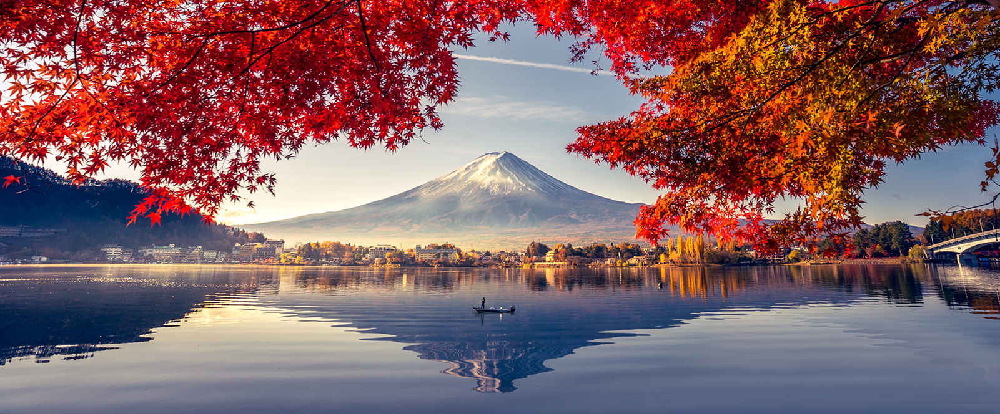

Hi, my name is Jovanni. I'm currently in the Statistics Master's program at NC State. I am also a full time software developer.

- 👀 I’m interested in __sports__, __programming__ and __statistics__
- 🌱 I’m currently learning about <code>Data Science For Statisticians</code>
- 💞️ I’m looking to collaborate on _data science_ projects!
- 📫 How to reach me: jcatala@ncsu.edu
-
I will be blogging about topics in my ST 558 Data Science in R course.

([google](https://www.google.com/?client=safari))

